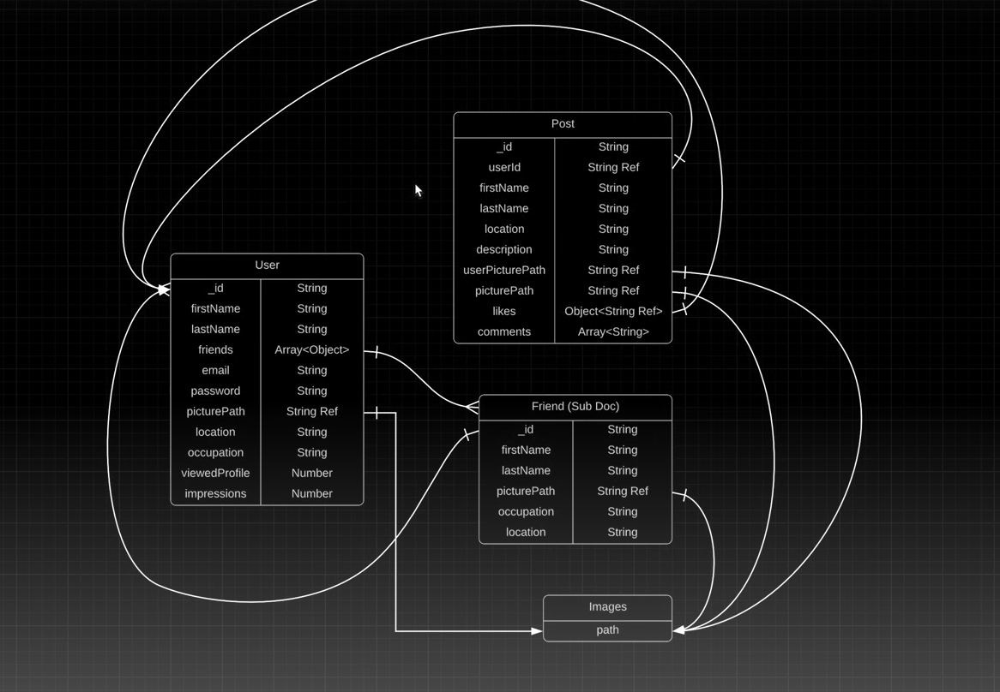

# About Backend of this project:
[Click to see project Video](https://youtu.be/K8YELRmUb5o?si=53eeq6H7Ck9bS_p_)

if you want to add some garbage data then watch at: 1:35
# Notes

1. **bodyParser**: This middleware parses incoming request bodies in a middleware before your handlers, making it available under the req.body property.
2. **cors**: This middleware is used to enable Cross-Origin Resource Sharing (CORS) with various options.
Other Options:
 > app.use(cors()): Enables CORS for all routes.
 > app.use(cors({ origin: 'http://example.com' })): Restricts CORS to a specific domain.
 > cors({ methods: ['GET', 'POST'] }): Restricts the allowed HTTP methods
3. **dotenv**: This module loads environment variables from a ".env" file into "process.env."
Other Options:
 > dotenv.config({ path: './custom/path/to/.env' }): Load environment variables from a custom path.
 >dotenv.parse(Buffer.from(...)): Manually parse a Buffer containing environment variables.
4. **Morgan** is a powerful and flexible logging tool for Express applications, providing several built-in formats and the ability to create custom formats. It helps developers monitor their applications by logging incoming HTTP requests, which can be crucial for debugging and performance analysis.
5. **app.use()** is a method in Express that adds middleware to your application. Middleware functions are functions that have access to the request object (req), the response object (res), and the next middleware function in the application’s request-response cycle.

6. Database we are gonna use i this project. 

**Authentication ->** To cross check login credentials from is user.
**Authorisation ->** To provide facilities after login i.e. only for recognised users.

## Program flow

after stablishing connection with DB 
- we have to create a route for user's register
- call fuction, but write code in controllers folder, 
- here call User model to work with

## Each facility has 3 things:
- model
- route
- controller